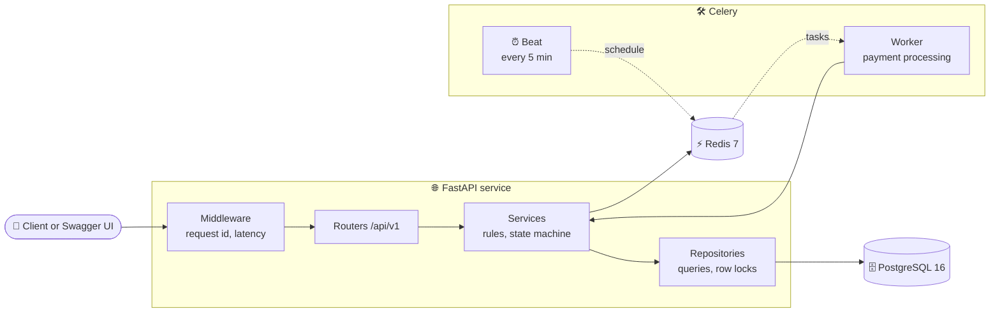
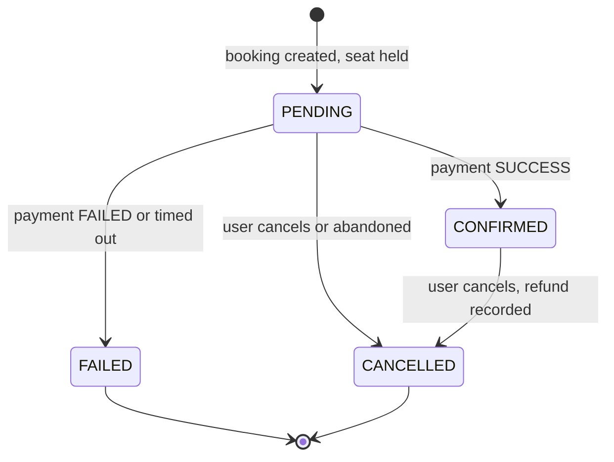
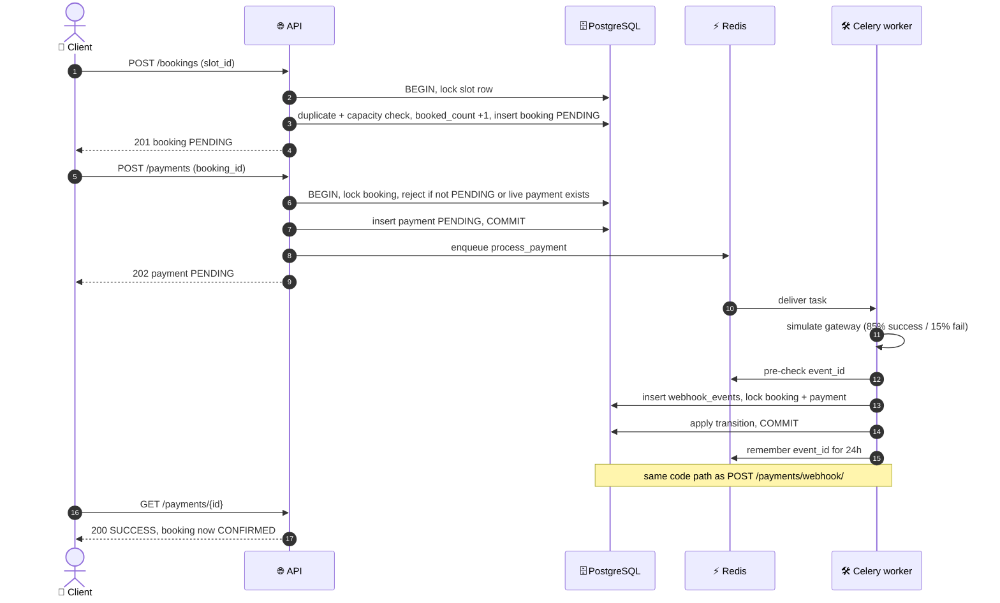
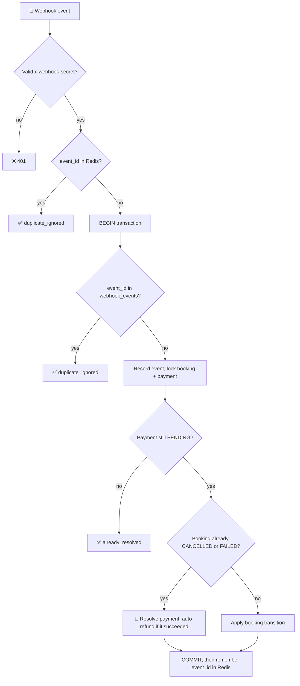
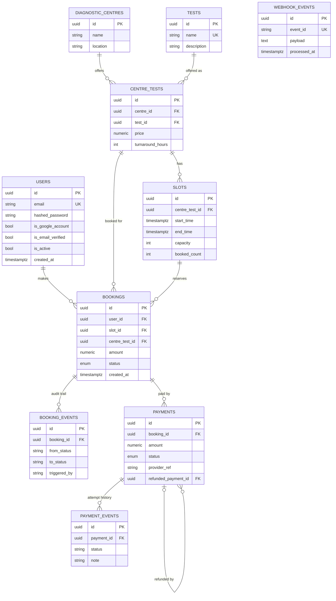

<div align="center">

# 🏥 CareFlow
### EVE Healthcare · Diagnostic Booking & Payments API

**Book a test. Pay for it. Stay correct under retries, races and partial failures.**


[✨ Highlights](#-highlights) · [🚀 Quick Start](#-quick-start) · [📡 API](#-api-reference) · [🔄 Flow](#-booking--payment-flow) · [🗄️ Database](#️-database-design) · [🛡️ Security](#️-security) · [🧭 Assumptions](#-assumptions) · [🔮 Improvements](#-what-id-improve-next)

</div>

---

> 💡 **The idea:** no double bookings, no double-processed payments, and no booking that disagrees with its payment, even when requests are retried, replayed or race each other.

## ✨ Highlights

| | Quality | How it is achieved |
|---|---|---|
| 💰 | **Money-safe webhooks** | Three idempotency layers: Redis fast path, unique `event_id` in Postgres, and a "payment must still be `PENDING`" guard |
| 🔒 | **Race-safe** | `SELECT ... FOR UPDATE` on slots, bookings and payments; the duplicate-booking check runs *inside* the slot lock |
| 🧭 | **One state machine** | Every booking change goes through a single `transition()` that validates the move, writes an audit event and releases the seat |
| ♻️ | **Self-healing** | Celery Beat fails payments whose result never arrived and cancels abandoned bookings |
| 💸 | **Auto-refund** | Money captured for an already-cancelled booking is refunded immediately and logged |
| 🛡️ | **Secure by default** | bcrypt, short-lived JWTs, refresh rotation with **theft detection**, sliding-window rate limits, no user enumeration |
| 🔍 | **Observable** | JSON logs with per-request ID (`X-Request-ID`), catch-all error handler, `/health` that probes Postgres and Redis |
| ✅ | **Tested** | 57 unit and integration tests on an isolated database |
| 📦 | **Reproducible** | One `docker compose up`, versioned Alembic migrations, idempotent seed script |

## 📋 Requirements Coverage

<details>
<summary><b>Click to expand the checklist</b></summary>

| Requirement | Status | Where |
|---|---|---|
| Signup, login, JWT, validation | ✅ | `/auth/*`, Pydantic schemas, password policy |
| Centres and tests (name, location, tests, price) | ✅ | `diagnostic_centres`, `tests`, `centre_tests` (price per centre) |
| Booking (user, test, centre, date/time, amount, status) | ✅ | `bookings` plus `slots`; statuses `PENDING`, `CONFIRMED`, `FAILED`, `CANCELLED` |
| Simulated `POST /payments/` → SUCCESS or FAILED, updates booking | ✅ | Async via Celery, shares the webhook code path |
| Idempotent `POST /payments/webhook/` | ✅ | [Webhook idempotency](#-webhook-idempotency) |
| Edge cases (bad input, repeats, bad IDs, failures, no auth) | ✅ | [Status codes](#-status-codes) |
| Bonus: Celery / background jobs | ✅ | Payments, reconciliation, cleanup |
| Bonus: Docker and docker-compose | ✅ | 5 services |
| Bonus: Swagger / OpenAPI | ✅ | `/docs`, `/redoc` |
| Bonus: Unit / integration tests | ✅ | 57 tests |
| Bonus: Structured logging | ✅ | JSON logs with request IDs |
| Bonus: Pagination | ✅ | `skip` and `limit` on list endpoints |
| Bonus: Rate limiting | ✅ | Sliding window on login and signup |
| Bonus: Webhook retry handling | ✅ | Celery retries (3x) plus idempotent handler |
| Bonus: Redis | ✅  Partial | Rate limiting, idempotency, token state. Catalog caching not implemented |

</details>

## 🧰 Tech Stack

| Layer | Technology | Role |
|---|---|---|
| 🌐 API | **FastAPI** + Uvicorn | HTTP, Pydantic v2 validation, dependency injection |
| 🗄️ Database | **PostgreSQL 16** | Source of truth, transactions, row locks |
| ⚡ Cache | **Redis 7** | Broker, rate limits, webhook dedup, token state |
| 🛠️ Jobs | **Celery 5.4** (worker + beat) | Async payments, reconciliation, cleanup |
| 🧱 ORM / migrations | **SQLAlchemy** + **Alembic** | Models, repositories, versioned schema |
| 🐳 Runtime | **Docker Compose** | Five services, one command |
| 🧪 Testing | **pytest** + `TestClient` | Unit and integration tests |

## 🏗️ Architecture



| Service | Role | Port |
|---|---|---|
| 🌐 `api` | FastAPI with hot reload | `8000` |
| 🛠️ `celery-worker` | Runs payment tasks | - |
| ⏰ `celery-beat` | Reconciliation and cleanup every 5 minutes | - |
| 🗄️ `postgres` | System of record (`eve_db`, user `eve`) | `5432` |
| ⚡ `redis` | Broker, rate limits, dedup, token state | `6379` |

**Layering rule:** routers parse HTTP, services own business rules and transactions, repositories own queries and locks. Services never touch the request object and routers never touch SQLAlchemy, so business logic is unit-testable without HTTP.

## 🚀 Quick Start

**Prerequisite:** Docker (Desktop, or Engine with Compose v2). Nothing else.

```bash
git clone <your-repo-url> && cd CareFlow

cp .env.example .env            # PowerShell: copy .env.example .env
# Set JWT_SECRET, SESSION_SECRET and WEBHOOK_SHARED_SECRET to three different long random strings

docker compose up --build -d
docker compose exec api alembic upgrade head           # create the schema
docker compose exec api python -m scripts.seed_data    # optional sample data
```

The seed script creates 3 centres, 4 tests, 8 offerings and 96 future slots, and is safe to run repeatedly.

| 🔗 | URL |
|---|---|
| 📖 Swagger UI | http://localhost:8000/docs (click **Authorize**, paste the access token without `Bearer `) |
| 📘 ReDoc | http://localhost:8000/redoc |
| ❤️ Health | http://localhost:8000/health (`503` if Postgres or Redis is down) |

> 📧 **Emails are mocked.** Links are written to the API log:
> `docker compose logs api | grep "MOCK EMAIL"`
> To skip verification while exploring, set `REQUIRE_EMAIL_VERIFICATION=false` in `.env`, then `docker compose up -d --force-recreate`.

### ⚙️ Configuration

Changes to `.env` need `docker compose up -d --force-recreate` (`restart` does not re-read it).

| Variable | Default | Purpose |
|---|---|---|
| `DATABASE_URL` / `REDIS_URL` | compose services | Connections |
| `JWT_SECRET` | **required** | Signs access, refresh, reset and verification tokens |
| `SESSION_SECRET` | placeholder | Google OAuth session cookie |
| `WEBHOOK_SHARED_SECRET` | placeholder | Authenticates webhooks. **Change it** |
| `ACCESS_TOKEN_EXPIRE_MINUTES` | `15` | Access token lifetime |
| `REFRESH_TOKEN_EXPIRE_DAYS` | `7` | Refresh token lifetime |
| `RESET_TOKEN_EXPIRE_MINUTES` | `30` | Password reset window |
| `VERIFY_TOKEN_EXPIRE_HOURS` | `24` | Email verification window |
| `LOGIN_RATE_LIMIT_ATTEMPTS` / `_WINDOW_SECONDS` | `5` / `300` | Login limiter |
| `SIGNUP_RATE_LIMIT_ATTEMPTS` / `_WINDOW_SECONDS` | `5` / `3600` | Signup limiter |
| `REQUIRE_EMAIL_VERIFICATION` | `true` | `false` for quick local testing |
| `GOOGLE_CLIENT_ID` / `_SECRET` / `GOOGLE_REDIRECT_URI` | empty | Optional Google sign-in |

## 📡 API Reference

Base path `/api/v1`. 🔓 public · 🔑 JWT · 🔐 webhook secret. Interactive docs at `/docs`.

### 🔐 Auth

| | Method | Path | Description |
|---|---|---|---|
| 🔓 | POST | `/auth/signup` | Create account. 5 per hour per IP |
| 🔓 | POST | `/auth/verify-email` | Confirm email with the emailed token |
| 🔓 | POST | `/auth/login` | Access and refresh tokens. 5 per 5 min per email and IP |
| 🔓 | POST | `/auth/refresh` | Rotate the refresh token, returns a new pair |
| 🔓 | POST | `/auth/forgot-password` | Always `202`, never reveals if the email exists |
| 🔓 | POST | `/auth/reset-password` | Set a new password. Reset token is single-use |
| 🔓 | GET | `/auth/google/login` | Start Google sign-in |
| 🔓 | GET | `/auth/google/callback` | Complete Google sign-in, returns tokens |

### 🏢 Catalog

| | Method | Path | Description |
|---|---|---|---|
| 🔓 | GET | `/centres/` | List centres (`skip`, `limit`) |
| 🔑 | POST | `/centres/` | Create a centre |
| 🔓 | GET | `/centres/{centre_id}` | One centre |
| 🔑 | POST | `/centres/{centre_id}/tests` | Offer a test at a centre with price and turnaround |
| 🔓 | GET | `/centres/{centre_id}/tests` | Tests a centre offers (each `id` is a `centre_test_id`) |
| 🔓 | GET | `/tests/` | Test catalog (`skip`, `limit`) |
| 🔑 | POST | `/tests/` | Add a test to the catalog |
| 🔑 | POST | `/slots/` | Create a bookable slot (must be in the future) |
| 🔓 | GET | `/slots/?centre_test_id=` | Slots with free capacity for an offering |

### 📅 Bookings & 💳 Payments

| | Method | Path | Description |
|---|---|---|---|
| 🔑 | POST | `/bookings/` | Book a slot → `PENDING`, holds a seat |
| 🔑 | GET | `/bookings/` | Your bookings (`skip`, `limit`) |
| 🔑 | GET | `/bookings/{id}` | One booking (owner only) |
| 🔑 | POST | `/bookings/{id}/cancel` | Cancel, free the seat, record a refund if it was `CONFIRMED` |
| 🔑 | POST | `/payments/` | Start a simulated payment → `202 PENDING` |
| 🔑 | GET | `/payments/{id}` | Payment status (owner only) |
| 🔐 | POST | `/payments/webhook/` | Idempotent callback, needs `x-webhook-secret` header |
| 🔓 | GET | `/health` | Dependency-aware health check |

### ⚠️ Status Codes

| Code | Meaning |
|---|---|
| `400` | Rule broken: duplicate booking or payment, not payable, slot expired, invalid transition |
| `401` | Bad or expired token, bad credentials, bad webhook secret, refresh-token reuse |
| `403` | Missing `Authorization` header, not the owner, email not verified |
| `404` | Unknown centre, test, slot, booking or payment |
| `409` | Slot is full |
| `422` | Validation: weak password, bad UUID, past slot time, invalid status |
| `429` | Rate limit hit |
| `500` | Generic body; traceback logged with the request ID |

### 🧪 Example Walkthrough

<details>
<summary><b>Click to expand: signup → book → pay → cancel</b></summary>

```bash
BASE=http://localhost:8000/api/v1
JSON='Content-Type: application/json'

# 1. Sign up, verify (token is in the API log), log in
curl -s -X POST $BASE/auth/signup -H "$JSON" \
  -d '{"email":"demo@example.com","password":"Str0ng@Pass1"}'
docker compose logs api | grep "MOCK EMAIL"
curl -s -X POST $BASE/auth/verify-email -H "$JSON" -d '{"token":"<token from the log>"}'
curl -s -X POST $BASE/auth/login -H "$JSON" \
  -d '{"email":"demo@example.com","password":"Str0ng@Pass1"}'
# {"access_token":"eyJ...","refresh_token":"eyJ...","token_type":"bearer"}
TOKEN=<access_token>

# 2. Browse: centre → offerings → free slots
curl -s $BASE/centres/
curl -s $BASE/centres/<centre_id>/tests
curl -s "$BASE/slots/?centre_test_id=<centre_test_id>"

# 3. Book a slot
curl -s -X POST $BASE/bookings/ -H "Authorization: Bearer $TOKEN" -H "$JSON" \
  -d '{"slot_id":"<slot_id>"}'
```

```json
{
  "id": "5bea7331-1c5a-49e8-9cf9-15e3f43c9fff",
  "slot_id": "e1cdfcd9-68a9-41f2-83c6-4c49b0246c93",
  "centre_test_id": "14d5dbc4-5237-4aca-b813-3ba3a7992840",
  "amount": "500.00",
  "status": "PENDING",
  "created_at": "2026-09-26T18:58:47.951163Z"
}
```

```bash
# 4. Pay. Returns 202 immediately; the worker settles it in the background
curl -s -X POST $BASE/payments/ -H "Authorization: Bearer $TOKEN" -H "$JSON" \
  -d '{"booking_id":"<booking_id>"}'
# {"id":"...","booking_id":"...","amount":"500.00","status":"PENDING","created_at":"..."}

# 5. Poll: payment → SUCCESS or FAILED, booking → CONFIRMED or FAILED
curl -s $BASE/payments/<payment_id> -H "Authorization: Bearer $TOKEN"
curl -s $BASE/bookings/<booking_id> -H "Authorization: Bearer $TOKEN"

# 6. Cancel (frees the seat; a CONFIRMED booking also gets a REFUNDED payment row)
curl -s -X POST $BASE/bookings/<booking_id>/cancel -H "Authorization: Bearer $TOKEN"
```

**Call the webhook by hand.** The simulator settles payments within a second, so first run `docker compose stop celery-worker`, create a payment, then:

```bash
curl -s -X POST $BASE/payments/webhook/ -H "$JSON" \
  -H "x-webhook-secret: <WEBHOOK_SHARED_SECRET from .env>" \
  -d '{"event_id":"evt-123","booking_id":"<booking_id>","payment_id":"<payment_id>","status":"SUCCESS","provider_ref":"PSP-1"}'
# {"status":"processed","event_id":"evt-123","payment_status":"SUCCESS"}
# Send the exact same request again:
# {"status":"duplicate_ignored","event_id":"evt-123"}
```

Restart the worker afterwards: `docker compose start celery-worker`.

</details>

## 🔄 Booking & Payment Flow

### 📊 Booking state machine



`FAILED` and `CANCELLED` are terminal and both release the seat. Any transition not drawn above is rejected with `400`.

### 🧵 End-to-end sequence



> 🎯 The simulator feeds its result through the **same service method** the HTTP webhook uses, so simulated and "real" callbacks cannot behave differently.

### 🔁 Webhook Idempotency



| Layer | Stops |
|---|---|
| ⚡ Redis `event_id` key (24h) | Cheap replays. An optimisation, not the source of truth |
| 🗄️ Unique `webhook_events.event_id` | Replays after the Redis key expires or Redis is flushed |
| 🚧 "Payment must be `PENDING`" | A *different* event trying to change a settled payment |
| 🧭 Booking state machine | Illegal booking transitions |

Redis is written **after** the DB commit, so a failed commit can never leave Redis claiming an event was processed.

> 💸 **The late-success case.** If the user cancels while payment is in flight and the success callback arrives afterwards, the handler does not throw (that would roll back the dedup record and leave the payment `PENDING` forever). It records the payment as `SUCCESS`, immediately writes a linked `REFUNDED` row, and logs a warning. Money is never captured without a record of returning it.

### 🔒 Concurrency Control

| Operation | Lock taken | Prevents |
|---|---|---|
| Create booking | `slots` row | Overselling; the duplicate check runs inside this lock |
| Cancel booking | `bookings` then `slots` row | Cancel racing a payment result |
| Create payment | `bookings` row | Paying for a booking being cancelled; duplicate live payments |
| Process webhook | `bookings` and `payments` rows | A duplicate or late event racing a real one |
| Abandoned-booking cleanup | `bookings` row | Cancelling a booking that just got a payment |

### ⏰ Background Jobs

| Task | Schedule | Behaviour |
|---|---|---|
| `process_payment_async` | On payment creation | Simulates the gateway (85% `SUCCESS`, 15% `FAILED`). 3 retries, 5s apart; safe because the handler is idempotent |
| `reconcile_stuck_payments` | Every 5 min | Payments `PENDING` for over 10 min are failed through the webhook path |
| `expire_abandoned_bookings` | Every 5 min | `PENDING` bookings older than 15 min with no live payment are cancelled and the seat freed |

## 🗄️ Database Design



| Enum | Values |
|---|---|
| 📅 `BookingStatus` | `PENDING`, `CONFIRMED`, `FAILED`, `CANCELLED` |
| 💳 `PaymentStatus` | `PENDING`, `SUCCESS`, `FAILED`, `REFUNDED` |

### 🧠 Design Decisions

| Decision | Reasoning |
|---|---|
| **`tests` separate from `centre_tests`** | The same test ("CBC") exists at many centres with different prices. `UNIQUE (centre_id, test_id)` stops duplicate listings |
| **`slots` carry `capacity` and `booked_count`** | The double-booking guard, checked and incremented under a row lock. `UNIQUE (centre_test_id, start_time)` prevents duplicate slots |
| **`bookings.amount` is a snapshot** | A later price change must not alter what a customer already agreed to pay |
| **Three event tables** | `webhook_events` = "seen this event?", `payment_events` = "what happened to this payment?", `booking_events` = "who changed this booking's state?" |
| **Refunds are new rows** | The original `SUCCESS` payment is never overwritten; a `REFUNDED` row points back via `refunded_payment_id` |
| **UUID keys, enum statuses** | Not guessable or enumerable; invalid states can't be stored |
| **`Numeric(10, 2)` for money** | No floating-point rounding errors |
| **Indexes** | `users.email`, `tests.name`, `bookings.user_id`, `bookings.slot_id`, `payments.booking_id`, `webhook_events.event_id`, event-table foreign keys |

The schema is managed **only by Alembic** (`alembic/versions/`). `create_all()` is never used.

## ⚡ Redis Usage

| Use | Key / mechanism | Notes |
|---|---|---|
| 🚦 Signup limiter | `signup_attempts:*` | Sliding window, atomic Lua script |
| 🚦 Login limiter | `login_attempts:*` | Sliding window, atomic Lua script |
| 🔁 Webhook dedup | `webhook_processed:<event_id>` | 24h TTL, written after DB commit |
| 🎟️ Token state | Refresh-token `jti`, single-use reset marker | Enables rotation and theft detection |
| 📬 Broker | Celery task queue | Payment tasks and beat schedule |

## 🛡️ Security

| Area | Implementation |
|---|---|
| 🔑 Passwords | bcrypt. 8-72 chars with upper, lower, digit, special; the 72 cap matches bcrypt's limit, so long inputs get a clean `422` |
| 🎟️ Tokens | Access JWT (15 min) and refresh JWT (7 days), typed (`access` vs `refresh`); each refresh token carries a `jti` tracked in Redis |
| 🕵️ Theft detection | Every refresh revokes the old token. Presenting an already-rotated token means it was copied, so **all sessions for that user are revoked** |
| 🚦 Rate limiting | Sliding-window log on a Redis sorted set, one atomic Lua script (no check-then-record race, no window-edge bursts) |
| 🙈 No enumeration | One generic login error; `forgot-password` always `202`; signup failure says "Could not create account" |
| 🔗 Reset / verify | Signed expiring tokens; reset is single-use via a Redis marker; verification lasts 24h and login is blocked until verified |
| 🪝 Webhook auth | Shared secret in `x-webhook-secret` |
| 👮 Authorization | Ownership checked on every booking and payment read or write (`403`) |
| 🧯 Error hygiene | Custom exceptions map to clean JSON; unexpected errors return a generic body and log the traceback with the request ID |
| 🤐 Secrets | Environment variables only; `.env` is git-ignored |

## 🧪 Testing

```bash
docker compose exec postgres psql -U eve -d eve_db -c "CREATE DATABASE eve_test_db;"   # once
docker compose exec api python -m pytest tests/ -q -p no:warnings
```

**57 tests**

| Suite | Location | Covers |
|---|---|---|
| 🧠 Unit | `tests/unit` | Booking capacity and duplicates, seat release, payment rules, webhook idempotency, auto-refund |
| 🌐 Integration | `tests/integration` | Auth flows, catalog CRUD, ownership rules, webhook auth, replay, conflicting events, late-success refund |

| Technique | Detail |
|---|---|
| 🔄 Per-test rollback | Separate `eve_test_db`; each test runs in a transaction that is rolled back |
| 🎭 `fake_task` fixture | Autouse; patches out Celery dispatch so tests never enqueue real jobs |
| 🎲 Deterministic payments | The 85/15 outcome is forced in tests |
| 🏭 Factories | `make_auth_headers`, `make_slot` build realistic data quickly |
| 🧹 Redis hygiene | Rate-limit keys cleared at session start |

> ⚠️ Run tests against a local dev stack, not a shared one.

## 🗂️ Project Structure

```
.
├── app/
│   ├── main.py                  # app wiring, error handlers, /health
│   ├── api/
│   │   ├── deps.py              # current-user dependency
│   │   └── v1/                  # thin routers: auth, centres, tests, slots,
│   │                            #   bookings, payments, webhooks
│   ├── core/                    # config, security, redis, exceptions,
│   │                            #   logging, middleware, celery app
│   ├── db/                      # base, session, transaction() context manager
│   ├── models/                  # SQLAlchemy models
│   ├── repositories/            # queries and row locks
│   ├── schemas/                 # Pydantic request/response models
│   ├── services/                # auth, catalog, booking, payment, webhook, email
│   └── tasks/                   # Celery: payments, reconciliation, cleanup
├── alembic/versions/            # schema migrations
├── scripts/seed_data.py         # idempotent sample data
├── tests/                       # unit/ and integration/
├── Dockerfile
├── docker-compose.yml
└── .env.example
```

## 🧭 Assumptions

| # | Assumption |
|---|---|
| 1 | 💳 **The payment provider is simulated.** A worker picks `SUCCESS` (85%) or `FAILED` (15%) and settles through the same service method as the HTTP webhook. No real money moves |
| 2 | 📧 **Email is mocked.** Links go to the API log; swapping in SMTP or SES only touches `services/email.py` |
| 3 | 👥 **No admin role.** The spec defines none, so any signed-in user can create centres, tests and slots. Catalog reads are public |
| 4 | 📅 **A slot is the appointment.** Date and time is the slot's `start_time`; a booking holds one seat until it fails or is cancelled |
| 5 | 🚫 **One active booking per user per slot** (`PENDING` and `CONFIRMED` count) |
| 6 | 🧾 **Amounts are snapshotted** from the centre price at booking time |
| 7 | ↩️ **Refunds are recorded, not executed:** a `REFUNDED` row linked to the original payment |
| 8 | 🔚 **`FAILED` and `CANCELLED` are terminal.** Retrying means a new booking |
| 9 | 🌍 **All timestamps are UTC** |
| 10 | 🔐 **Missing `Authorization` → `403`; invalid or expired token → `401`** (FastAPI `HTTPBearer` default) |
| 11 | 🔵 **Google sign-in users are treated as email-verified** and have no password |

## 🔮 What I'd Improve Next

| Priority | Area | Improvement |
|---|---|---|
| 🔴 | Correctness | **Concurrent identical webhooks:** state stays safe (unique constraint), but the losing request can surface as `500`. Catch `IntegrityError` on the event insert and return `duplicate_ignored` |
| 🔴 | Security | **HMAC-signed webhooks** with timestamp tolerance and constant-time comparison, replacing the shared secret |
| 🔴 | Correctness | **DB `CHECK` constraints**, e.g. `0 <= booked_count <= capacity`, as a second line of defence behind app locks |
| 🟠 | Testing | **Parallel-load tests** for the locking guarantees, plus a test for the abandoned-booking cleanup (back-date `created_at`) |
| 🟠 | Security | **Logout and access-token revocation** (only refresh tokens are revocable today) |
| 🟠 | Security | **Cap `limit`** on paginated endpoints (e.g. `le=100`) and add **admin/staff roles** |
| 🟡 | Performance | **Cache catalog reads in Redis** with invalidation on writes |
| 🟡 | Reliability | **Real email delivery** via a Celery task with retries; **transactional outbox** so a payment task can't be lost between commit and publish |
| 🟡 | Ops | **Production compose:** no `--reload` or source mounts, non-root containers, Gunicorn + Uvicorn workers, healthchecks, migrations in the entrypoint, secrets manager |
| 🟡 | Ops | **Metrics and tracing** (Prometheus, OpenTelemetry) alongside request-ID logs; **CI pipeline** |
| 🟡 | Product | Cursor pagination with totals, waitlist for full slots, rescheduling, per-centre timezones |

## 🩹 Troubleshooting

| Symptom | Fix |
|---|---|
| `relation "users" does not exist` | `docker compose exec api alembic upgrade head` |
| `.env` change ignored | `docker compose up -d --force-recreate` (`restart` doesn't re-read env files) |
| Celery code change not picked up | `docker compose restart celery-worker celery-beat` (no hot reload) |
| `429 Too many attempts` | Wait, or `docker compose exec redis redis-cli DEL "login_attempts:<email>:<ip>"` |
| `401` after a while | Access tokens last 15 min. Log in again or call `/auth/refresh` |
| Webhook returns `already_resolved` | The worker settled it first. Stop the worker to test by hand |

---

<div align="center">

### Built with  by **Rishabh Pandey** for the EVE Healthcare SDE Intern assignment

`FastAPI` · `PostgreSQL` · `Redis` · `Celery` · `Docker`

</div>