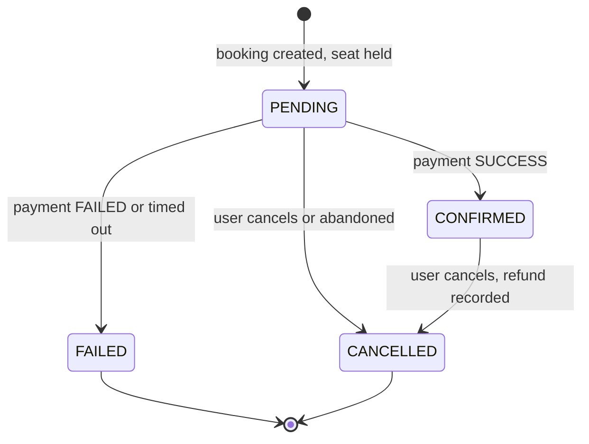
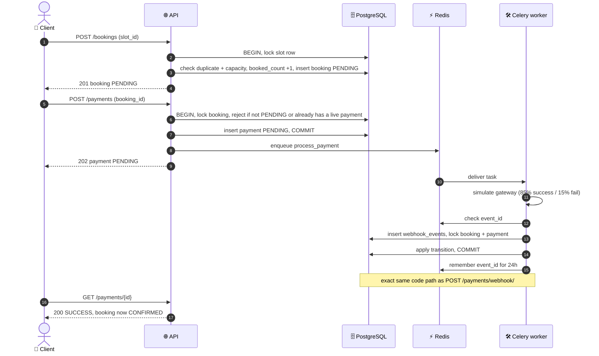
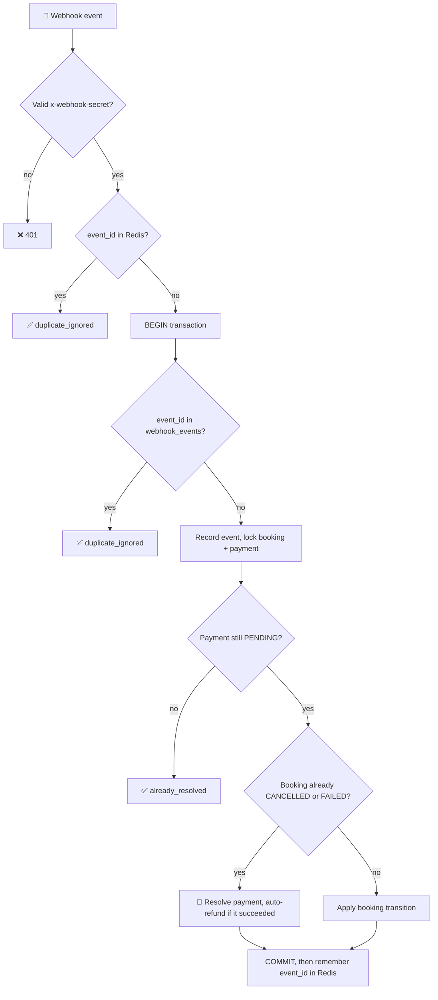
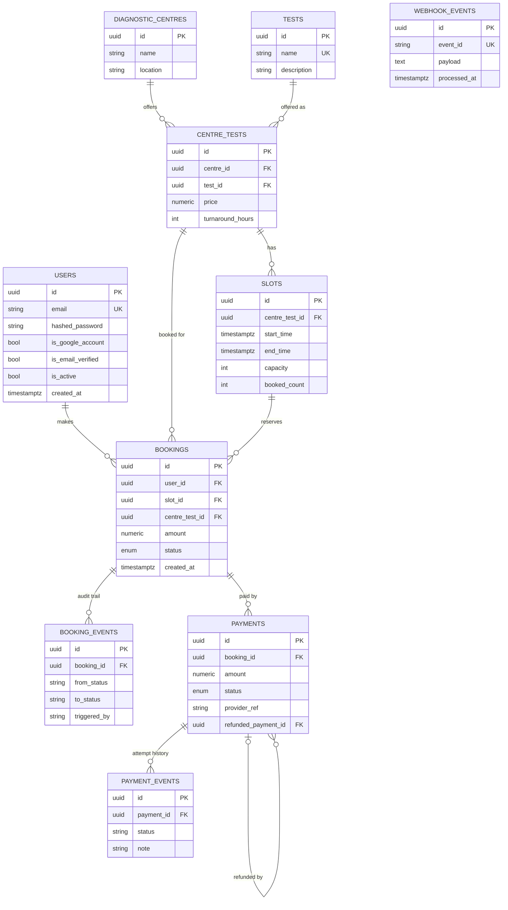

<div align="center">

# 🏥 CareFlow
### EVE Healthcare · Diagnostic Booking & Payments API

**Book a test. Pay for it. Don't break anything when requests retry, replay, or race each other.**


[✨ Highlights](#-highlights) · [🚀 Quick Start](#-quick-start) · [📡 API](#-api-reference) · [🔄 Flow](#-booking--payment-flow) · [🗄️ Database](#️-database-design) · [🛡️ Security](#️-security) · [🧭 Assumptions](#-assumptions) · [🔮 Improvements](#-what-id-improve-next)

</div>

---

> 💡 **The goal here:** no double bookings, no payment processed twice, and no booking that ends up disagreeing with its own payment — even if a request gets retried, a webhook fires twice, or two people hit the same slot at the same second.

## ✨ Highlights

| | Quality | How |
|---|---|---|
| 💰 | **Webhooks can't double-charge** | Three layers of protection: a Redis check, a unique `event_id` in Postgres, and a rule that the payment must still be `PENDING` before anything changes |
| 🔒 | **No race conditions** | Slots, bookings and payments all get row-locked (`SELECT ... FOR UPDATE`) before anything touches them; the duplicate-booking check happens *inside* that lock, not before it |
| 🧭 | **One place owns booking state** | Every status change goes through a single `transition()` function — it checks the move is legal, logs it, and frees the seat if needed. No second path to drift out of sync |
| ♻️ | **Fixes itself** | Celery Beat sweeps up payments that never got a result and cancels bookings nobody paid for |
| 💸 | **Refunds happen automatically** | If money gets captured for a booking that was already cancelled, it's refunded right away and logged |
| 🛡️ | **Secure out of the box** | bcrypt, short-lived JWTs, refresh token rotation with theft detection, rate limits, no way to enumerate accounts |
| 🔍 | **You can actually debug it** | JSON logs with a request ID on everything, a catch-all error handler, and a `/health` endpoint that really checks Postgres and Redis |
| ✅ | **Tested** | 60 unit and integration tests, all against an isolated database |
| 📦 | **One command to run it** | `docker compose up`, Alembic handles migrations, seed script is safe to rerun |

## 📋 Requirements Coverage

<details>
<summary><b>Click to expand the checklist</b></summary>

| Requirement | Status | Where |
|---|---|---|
| Signup, login, JWT, validation | ✅ | `/auth/*`, Pydantic schemas, password policy |
| Centres and tests (name, location, tests, price) | ✅ | `diagnostic_centres`, `tests`, `centre_tests` (price per centre) |
| Booking (user, test, centre, date/time, amount, status) | ✅ | `bookings` plus `slots`; statuses `PENDING`, `CONFIRMED`, `FAILED`, `CANCELLED` |
| Simulated `POST /payments/` → SUCCESS or FAILED, updates booking | ✅ | Async via Celery, shares the webhook code path |
| Idempotent `POST /payments/webhook/` | ✅ | [Webhook idempotency](#-webhook-idempotency) |
| Edge cases (bad input, repeats, bad IDs, failures, no auth) | ✅ | [Status codes](#-status-codes) |
| Bonus: Celery / background jobs | ✅ | Payments, reconciliation, cleanup |
| Bonus: Docker and docker-compose | ✅ | 5 services |
| Bonus: Swagger / OpenAPI | ✅ | `/docs`, `/redoc` |
| Bonus: Unit / integration tests | ✅ | 60 tests |
| Bonus: Structured logging | ✅ | JSON logs with request IDs |
| Bonus: Pagination | ✅ | `skip` and `limit` on list endpoints |
| Bonus: Rate limiting | ✅ | Sliding window on login and signup |
| Bonus: Webhook retry handling | ✅ | Celery retries (3x) plus idempotent handler |
| Bonus: Redis | 🟡 Partial | Rate limiting, idempotency, token state. Catalog caching not implemented |

</details>

## 🧰 Tech Stack

| Layer | Technology | Role |
|---|---|---|
| 🌐 API | **FastAPI** + Uvicorn | HTTP, Pydantic v2 validation, dependency injection |
| 🗄️ Database | **PostgreSQL 16** | Source of truth, transactions, row locks |
| ⚡ Cache | **Redis 7** | Broker, rate limits, webhook dedup, token state |
| 🛠️ Jobs | **Celery 5.4** (worker + beat) | Async payments, reconciliation, cleanup |
| 🧱 ORM / migrations | **SQLAlchemy** + **Alembic** | Models, repositories, versioned schema |
| 🐳 Runtime | **Docker Compose** | Five services, one command |
| 🧪 Testing | **pytest** + `TestClient` | Unit and integration tests |

## 🏗️ Architecture


| Service | Role | Port |
|---|---|---|
| 🌐 `api` | FastAPI with hot reload | `8000` |
| 🛠️ `celery-worker` | Runs payment tasks | - |
| ⏰ `celery-beat` | Reconciliation and cleanup every 5 minutes | - |
| 🗄️ `postgres` | System of record (`eve_db`, user `eve`) | `5432` |
| ⚡ `redis` | Broker, rate limits, dedup, token state | `6379` |

**How the layers split up:** routers just parse HTTP, services own the business rules and transactions, repositories own the queries and locks. Services never touch the request object and routers never touch SQLAlchemy directly — so the business logic can be tested without spinning up HTTP at all.

## 🚀 Quick Start

**You need:** Docker (Desktop, or Engine with Compose v2). Nothing else.

```bash
git clone https://github.com/rishabhdev0/eve-sde-assignment.git CareFlow
cd CareFlow

cp .env.example .env            # PowerShell: copy .env.example .env
# Set JWT_SECRET, SESSION_SECRET and WEBHOOK_SHARED_SECRET to three different long random strings

docker compose up --build -d
docker compose exec api alembic upgrade head           # creates the schema
docker compose exec api python -m scripts.seed_data    # optional sample data
```

The seed script drops in 3 centres, 4 tests, 8 offerings, and 96 future slots. Safe to run more than once.

| 🔗 | URL |
|---|---|
| 📖 Swagger UI | http://localhost:8000/docs (hit **Authorize**, paste the access token, skip the `Bearer ` part) |
| 📘 ReDoc | http://localhost:8000/redoc |
| ❤️ Health | http://localhost:8000/health (returns `503` if Postgres or Redis is down) |

> 📧 **Emails are mocked.** The link just gets written to the API log:
> `docker compose logs api | grep "MOCK EMAIL"`
> Want to skip verification entirely while you're poking around? Set `REQUIRE_EMAIL_VERIFICATION=false` in `.env`, then `docker compose up -d --force-recreate`.

### ⚙️ Configuration

Changing `.env`? You need `docker compose up -d --force-recreate` — a plain `restart` won't pick it up.

| Variable | Default | Purpose |
|---|---|---|
| `DATABASE_URL` / `REDIS_URL` | compose services | Connections |
| `JWT_SECRET` | **required** | Signs access, refresh, reset and verification tokens |
| `SESSION_SECRET` | placeholder | Google OAuth session cookie |
| `WEBHOOK_SHARED_SECRET` | placeholder | Authenticates webhooks — **change this before shipping** |
| `ACCESS_TOKEN_EXPIRE_MINUTES` | `15` | Access token lifetime |
| `REFRESH_TOKEN_EXPIRE_DAYS` | `7` | Refresh token lifetime |
| `RESET_TOKEN_EXPIRE_MINUTES` | `30` | Password reset window |
| `VERIFY_TOKEN_EXPIRE_HOURS` | `24` | Email verification window |
| `LOGIN_RATE_LIMIT_ATTEMPTS` / `_WINDOW_SECONDS` | `5` / `300` | Login limiter |
| `SIGNUP_RATE_LIMIT_ATTEMPTS` / `_WINDOW_SECONDS` | `5` / `3600` | Signup limiter |
| `REQUIRE_EMAIL_VERIFICATION` | `true` | `false` for quick local testing |
| `GOOGLE_CLIENT_ID` / `_SECRET` / `GOOGLE_REDIRECT_URI` | empty | Optional Google sign-in |

## 📡 API Reference

Base path `/api/v1`. 🔓 public · 🔑 needs a JWT · 🔐 needs the webhook secret. Full interactive docs at `/docs`.

### 🔐 Auth

| | Method | Path | What it does |
|---|---|---|---|
| 🔓 | POST | `/auth/signup` | Creates an account. 5 per hour per IP |
| 🔓 | POST | `/auth/verify-email` | Confirms the email using the token that was "sent" |
| 🔓 | POST | `/auth/login` | Returns access + refresh tokens. 5 attempts per 5 min per email/IP |
| 🔓 | POST | `/auth/refresh` | Swaps a refresh token for a new pair |
| 🔓 | POST | `/auth/forgot-password` | Always returns `202`, doesn't leak whether the email exists |
| 🔓 | POST | `/auth/reset-password` | Sets a new password. Reset token only works once |
| 🔓 | GET | `/auth/google/login` | Kicks off Google sign-in |
| 🔓 | GET | `/auth/google/callback` | Finishes Google sign-in, returns tokens |

### 🏢 Catalog

| | Method | Path | What it does |
|---|---|---|---|
| 🔓 | GET | `/centres/` | Lists centres (`skip`, `limit`) |
| 🔑 | POST | `/centres/` | Creates a centre |
| 🔓 | GET | `/centres/{centre_id}` | Gets one centre |
| 🔑 | POST | `/centres/{centre_id}/tests` | Adds a test to a centre with its own price and turnaround |
| 🔓 | GET | `/centres/{centre_id}/tests` | Tests a centre offers (the `id` here is the `centre_test_id`) |
| 🔓 | GET | `/tests/` | The full test catalog (`skip`, `limit`) |
| 🔑 | POST | `/tests/` | Adds a test to the catalog |
| 🔑 | POST | `/slots/` | Creates a bookable slot (has to be in the future) |
| 🔓 | GET | `/slots/?centre_test_id=` | Slots that still have room |

### 📅 Bookings & 💳 Payments

| | Method | Path | What it does |
|---|---|---|---|
| 🔑 | POST | `/bookings/` | Books a slot → `PENDING`, holds the seat |
| 🔑 | GET | `/bookings/` | Your bookings (`skip`, `limit`) |
| 🔑 | GET | `/bookings/{id}` | One booking (only if you own it) |
| 🔑 | POST | `/bookings/{id}/cancel` | Cancels, frees the seat, writes a refund if it was `CONFIRMED` |
| 🔑 | POST | `/payments/` | Kicks off a simulated payment → `202 PENDING` |
| 🔑 | GET | `/payments/{id}` | Payment status (owner only) |
| 🔐 | POST | `/payments/webhook/` | Idempotent callback, needs the `x-webhook-secret` header |
| 🔓 | GET | `/health` | Actually checks the dependencies, not just "yeah I'm up" |

### ⚠️ Status Codes

| Code | Means |
|---|---|
| `400` | Rule broken — duplicate booking or payment, booking not payable, slot expired, illegal transition |
| `401` | Bad/expired token, wrong credentials, wrong webhook secret, or a reused refresh token |
| `403` | No `Authorization` header, not the owner, or email not verified |
| `404` | Centre, test, slot, booking or payment doesn't exist |
| `409` | Slot's full |
| `422` | Validation failed — weak password, bad UUID, slot in the past, bad status value |
| `429` | Hit the rate limit |
| `500` | Something broke; generic body back, full traceback in the logs tied to the request ID |

### 🧪 Example Walkthrough

<details>
<summary><b>Click to expand: signup → book → pay → cancel</b></summary>

```bash
BASE=http://localhost:8000/api/v1
JSON='Content-Type: application/json'

# 1. Sign up, verify (grab the token from the log), log in
curl -s -X POST $BASE/auth/signup -H "$JSON" \
  -d '{"email":"demo@example.com","password":"Str0ng@Pass1"}'
docker compose logs api | grep "MOCK EMAIL"
curl -s -X POST $BASE/auth/verify-email -H "$JSON" -d '{"token":"<token from the log>"}'
curl -s -X POST $BASE/auth/login -H "$JSON" \
  -d '{"email":"demo@example.com","password":"Str0ng@Pass1"}'
# {"access_token":"eyJ...","refresh_token":"eyJ...","token_type":"bearer"}
TOKEN=<access_token>

# 2. Browse: centre → offerings → free slots
curl -s $BASE/centres/
curl -s $BASE/centres/<centre_id>/tests
curl -s "$BASE/slots/?centre_test_id=<centre_test_id>"

# 3. Book a slot
curl -s -X POST $BASE/bookings/ -H "Authorization: Bearer $TOKEN" -H "$JSON" \
  -d '{"slot_id":"<slot_id>"}'
```

```json
{
  "id": "5bea7331-1c5a-49e8-9cf9-15e3f43c9fff",
  "slot_id": "e1cdfcd9-68a9-41f2-83c6-4c49b0246c93",
  "centre_test_id": "14d5dbc4-5237-4aca-b813-3ba3a7992840",
  "amount": "500.00",
  "status": "PENDING",
  "created_at": "2026-09-26T18:58:47.951163Z"
}
```

```bash
# 4. Pay — returns 202 right away, the worker settles it in the background
curl -s -X POST $BASE/payments/ -H "Authorization: Bearer $TOKEN" -H "$JSON" \
  -d '{"booking_id":"<booking_id>"}'
# {"id":"...","booking_id":"...","amount":"500.00","status":"PENDING","created_at":"..."}

# 5. Poll: payment → SUCCESS or FAILED, booking → CONFIRMED or FAILED
curl -s $BASE/payments/<payment_id> -H "Authorization: Bearer $TOKEN"
curl -s $BASE/bookings/<booking_id> -H "Authorization: Bearer $TOKEN"

# 6. Cancel (frees the seat; if it was CONFIRMED, you'll also get a REFUNDED payment row)
curl -s -X POST $BASE/bookings/<booking_id>/cancel -H "Authorization: Bearer $TOKEN"
```

**Want to hit the webhook yourself?** The simulator usually beats you to it (settles in under a second), so stop the worker first, then create a payment:

```bash
docker compose stop celery-worker

curl -s -X POST $BASE/payments/webhook/ -H "$JSON" \
  -H "x-webhook-secret: <WEBHOOK_SHARED_SECRET from .env>" \
  -d '{"event_id":"evt-123","booking_id":"<booking_id>","payment_id":"<payment_id>","status":"SUCCESS","provider_ref":"PSP-1"}'
# {"status":"processed","event_id":"evt-123","payment_status":"SUCCESS"}

# send it again, same event_id:
# {"status":"duplicate_ignored","event_id":"evt-123"}
```

Don't forget to bring the worker back: `docker compose start celery-worker`.

</details>

## 🔄 Booking & Payment Flow

### 📊 Booking state machine



`FAILED` and `CANCELLED` are dead ends, and both free the seat. Anything not shown above gets rejected with a `400`.

### 🧵 End-to-end sequence



> 🎯 The simulator doesn't have its own logic to "confirm" a payment — it just sends its result through the same service method the real webhook uses. So there's only ever one way a payment gets settled, whether it's simulated or real.

### 🔁 Webhook Idempotency



| Layer | What it stops |
|---|---|
| ⚡ Redis `event_id` key (24h) | Cheap, fast replays — just an optimization, not the real source of truth |
| 🗄️ Unique `webhook_events.event_id` | Replays that show up after the Redis key's already expired |
| 🚧 "Payment must be `PENDING`" | A *different* event trying to touch a payment that's already settled |
| 🧭 Booking state machine | Any transition that just doesn't make sense |

Redis only gets written **after** the DB commit succeeds — so if the commit fails, Redis never falsely claims the event was handled.

> 💸 **The late-success problem.** If someone cancels their booking while the payment's still processing, and then the success callback shows up anyway — the code doesn't throw an error. Throwing would roll back the whole transaction, including the record that this event was ever seen, so every retry would hit the exact same wall forever. Instead it marks the payment `SUCCESS`, writes a `REFUNDED` row right next to it, and logs a warning. Money never gets taken without a record of it going back.

### 🔒 Concurrency Control

| Operation | What gets locked | What it stops |
|---|---|---|
| Create booking | `slots` row | Overselling a slot; the duplicate check happens inside this same lock |
| Cancel booking | `bookings` then `slots` row | Cancel racing a payment result |
| Create payment | `bookings` row | Paying for a booking that's mid-cancel; two live payments on one booking |
| Process webhook | `bookings` and `payments` rows | A duplicate or late event stepping on a real one |
| Abandoned-booking cleanup | `bookings` row | Cancelling a booking that just got paid for |

### ⏰ Background Jobs

| Task | Runs | Does |
|---|---|---|
| `process_payment_async` | Right after a payment's created | Simulates the gateway (85% success, 15% fail). Retries up to 3 times, 5s apart — safe because the handler is idempotent anyway |
| `reconcile_stuck_payments` | Every 5 min | Anything still `PENDING` after 10 min gets failed through the normal webhook path |
| `expire_abandoned_bookings` | Every 5 min | `PENDING` bookings older than 15 min with no live payment get cancelled, seat freed |

## 🗄️ Database Design



| Enum | Values |
|---|---|
| 📅 `BookingStatus` | `PENDING`, `CONFIRMED`, `FAILED`, `CANCELLED` |
| 💳 `PaymentStatus` | `PENDING`, `SUCCESS`, `FAILED`, `REFUNDED` |

### 🧠 Design Decisions

| Decision | Why |
|---|---|
| **`tests` is a separate table from `centre_tests`** | Same test ("CBC") shows up at multiple centres with different prices, so this avoids duplicating the test itself. `UNIQUE (centre_id, test_id)` stops a centre listing the same test twice |
| **`slots` track `capacity` and `booked_count`** | That's the actual double-booking guard — checked and bumped under a row lock. `UNIQUE (centre_test_id, start_time)` also blocks duplicate slots |
| **`bookings.amount` is a snapshot** | If the centre changes its price later, it shouldn't retroactively change what someone already agreed to pay |
| **Three separate event tables** | Each one answers a different question — `webhook_events` = "have I seen this before?", `payment_events` = "what happened to this payment?", `booking_events` = "who changed this booking and to what?" |
| **Refunds are new rows, not edits** | The original `SUCCESS` payment never gets touched. A `REFUNDED` row points back to it with `refunded_payment_id`, so the history stays honest |
| **UUID keys, enum statuses** | Can't be guessed or enumerated, and invalid states just can't exist in the column |
| **`Numeric(10, 2)` for money** | No floating-point rounding weirdness |
| **Indexes** | `users.email`, `tests.name`, `bookings.user_id`, `bookings.slot_id`, `payments.booking_id`, `webhook_events.event_id`, plus the event tables' foreign keys |

The schema is managed **only through Alembic** (`alembic/versions/`). `create_all()` never runs.

## ⚡ Redis Usage

| Use | Key / mechanism | Notes |
|---|---|---|
| 🚦 Signup limiter | `signup_attempts:*` | Sliding window, one atomic Lua script |
| 🚦 Login limiter | `login_attempts:*` | Sliding window, one atomic Lua script |
| 🔁 Webhook dedup | `webhook_processed:<event_id>` | 24h TTL, only written after the DB commit lands |
| 🎟️ Token state | Refresh-token `jti`, single-use reset marker | What makes rotation and theft detection possible |
| 📬 Broker | Celery task queue | Payment tasks and the beat schedule |

## 🛡️ Security

| Area | What's actually done |
|---|---|
| 🔑 Passwords | bcrypt. 8-72 chars, needs upper, lower, digit and a special char. The 72 cap matches bcrypt's own limit, so long input just gets a clean `422` instead of quietly getting truncated |
| 🎟️ Tokens | Access JWT lasts 15 min, refresh lasts 7 days, both typed so one can't be used as the other. Each refresh token has a `jti` tracked in Redis |
| 🕵️ Theft detection | Every refresh kills the old token. If that exact old token ever shows up again, it means someone copied it — so **every session for that user gets revoked** |
| 🚦 Rate limiting | Sliding window on a Redis sorted set, done as one atomic Lua script so there's no gap between checking and recording, and no way to burst through at the edge of a window |
| 🙈 No account enumeration | Login gives one generic error either way; `forgot-password` always returns `202`; signup just says "Could not create account" |
| 🔗 Reset / verify | Signed tokens that expire; a reset token can only be used once; verification lasts 24h and login's blocked until you've done it |
| 🪝 Webhook auth | Shared secret in `x-webhook-secret` |
| 👮 Authorization | Every booking and payment read/write checks you actually own it — `403` if not |
| 🧯 Error handling | Custom exceptions turn into clean JSON; anything unexpected returns a generic body while the real traceback gets logged with the request ID |
| 🤐 Secrets | All from environment variables, `.env` is git-ignored |

## 🧪 Testing

```bash
docker compose exec postgres psql -U eve -d eve_db -c "CREATE DATABASE eve_test_db;"   # once
docker compose exec api python -m pytest tests/ -q -p no:warnings
```

**60 tests**

| Suite | Location | Covers |
|---|---|---|
| 🧠 Unit | `tests/unit` | Booking capacity and duplicates, seat release, payment rules, webhook idempotency, auto-refund, Celery retry behavior |
| 🌐 Integration | `tests/integration` | Auth flows, catalog CRUD, ownership rules, webhook auth, replay, conflicting events, late-success refund |

| Technique | Why |
|---|---|
| 🔄 Per-test rollback | Separate `eve_test_db`, each test runs inside a transaction that gets rolled back after |
| 🎭 `fake_task` fixture | Autouse — swaps out the real Celery task so tests never actually push anything to a broker |
| 🎲 Deterministic payments | The 85/15 random outcome gets forced in tests, no flakiness |
| 🏭 Factories | `make_auth_headers`, `make_slot` — build realistic data fast without repeating setup everywhere |
| 🧹 Redis hygiene | Rate-limit keys get wiped at the start of the session |

> ⚠️ Run these against your own local stack, not a shared one — they touch real Redis keys and a real (test) database.

## 🗂️ Project Structure

```
.
├── app/
│   ├── main.py                  # app wiring, error handlers, /health
│   ├── api/
│   │   ├── deps.py              # current-user dependency
│   │   └── v1/                  # thin routers: auth, centres, tests, slots,
│   │                            #   bookings, payments, webhooks
│   ├── core/                    # config, security, redis, exceptions,
│   │                            #   logging, middleware, celery app
│   ├── db/                      # base, session, transaction() context manager
│   ├── models/                  # SQLAlchemy models
│   ├── repositories/            # queries and row locks
│   ├── schemas/                 # Pydantic request/response models
│   ├── services/                # auth, catalog, booking, payment, webhook, email
│   └── tasks/                   # Celery: payments, reconciliation, cleanup
├── alembic/versions/            # schema migrations
├── scripts/seed_data.py         # idempotent sample data
├── tests/                       # unit/ and integration/
├── Dockerfile
├── docker-compose.yml
└── .env.example
```

## 🧭 Assumptions

Things I decided on my own, since the spec didn't spell them out:

| # | Assumption |
|---|---|
| 1 | 💳 **The payment provider is fake.** A worker just rolls the dice — 85% `SUCCESS`, 15% `FAILED` — and feeds the result through the same code path a real webhook would use. No actual money involved anywhere |
| 2 | 📧 **Email is mocked.** Links get dumped into the API log instead of sent. Swapping in real SMTP/SES only touches `services/email.py` |
| 3 | 👥 **No admin role.** Nothing in the spec asked for one, so right now any signed-in user can add centres, tests, and slots. Catalog reads are public regardless |
| 4 | 📅 **A slot is the appointment itself.** Its `start_time` is the appointment time, and a booking holds that seat until it fails or gets cancelled |
| 5 | 🚫 **One active booking per user per slot** — `PENDING` and `CONFIRMED` both count as active |
| 6 | 🧾 **The price gets locked in at booking time**, taken straight from the centre's price at that moment |
| 7 | ↩️ **Refunds are recorded, not actually processed** — since there's no real payment gateway, a `REFUNDED` row is written and linked back to the original |
| 8 | 🔚 **`FAILED` and `CANCELLED` are dead ends.** Want to try again? That's a new booking |
| 9 | 🌍 **Everything's stored in UTC** |
| 10 | 🔐 **No `Authorization` header → `403`. Bad or expired token → `401`.** That's just FastAPI's `HTTPBearer` default, didn't override it |
| 11 | 🔵 **Google sign-in users are treated as already verified** and don't have a password on file |

## 🔮 What I'd Improve Next

If I had more time, in rough order of what actually matters:

| Priority | Area | What |
|---|---|---|
| 🔴 | Correctness | **Two identical webhooks hitting at the exact same time** — the data stays correct (the unique constraint catches it), but the loser of that race can surface as a `500` instead of a clean `duplicate_ignored`. Fix is just catching the `IntegrityError` on insert |
| 🔴 | Security | **Real HMAC-signed webhooks** with a timestamp check, instead of the shared secret it uses now |
| 🔴 | Correctness | **DB-level `CHECK` constraints** like `0 <= booked_count <= capacity`, as a backup behind the app-level locks |
| 🟠 | Testing | **Actual parallel-load tests** to prove the locking works under real concurrency, plus a test for the abandoned-booking cleanup job |
| 🟠 | Security | **A real logout / access-token revocation** — right now only refresh tokens can be revoked |
| 🟠 | Security | **Cap the `limit` param** on list endpoints so nobody can request 10 million rows, and add real admin/staff roles |
| 🟡 | Performance | **Cache catalog reads in Redis**, invalidate on writes |
| 🟡 | Reliability | **Real email sending** through a retryable Celery task, and a transactional outbox so a payment task can't vanish between commit and publish |
| 🟡 | Ops | **A real production compose setup** — no `--reload`, no source mounts, non-root containers, Gunicorn + Uvicorn, healthchecks, migrations baked into the entrypoint, a proper secrets manager |
| 🟡 | Ops | **Metrics and tracing** (Prometheus, OpenTelemetry) alongside the request-ID logs, plus a CI pipeline |
| 🟡 | Product | Cursor-based pagination, a waitlist for full slots, rescheduling, per-centre timezones |

## 🩹 Troubleshooting

| Problem | Fix |
|---|---|
| `relation "users" does not exist` | `docker compose exec api alembic upgrade head` |
| Changed `.env` but nothing happened | `docker compose up -d --force-recreate` — `restart` doesn't re-read the file |
| Changed a Celery task but old code still runs | `docker compose restart celery-worker celery-beat` — no hot reload there |
| `429 Too many attempts` | Wait it out, or `docker compose exec redis redis-cli DEL "login_attempts:<email>:<ip>"` |
| `401` after everything was working fine | Access tokens expire in 15 min — log in again or call `/auth/refresh` |
| Webhook keeps returning `already_resolved` | The worker beat you to it. Stop it first if you want to test manually |

---

<div align="center">

### Built by **Rishabh Pandey** for the EVE Healthcare SDE Intern assignment

`FastAPI` · `PostgreSQL` · `Redis` · `Celery` · `Docker`

</div>